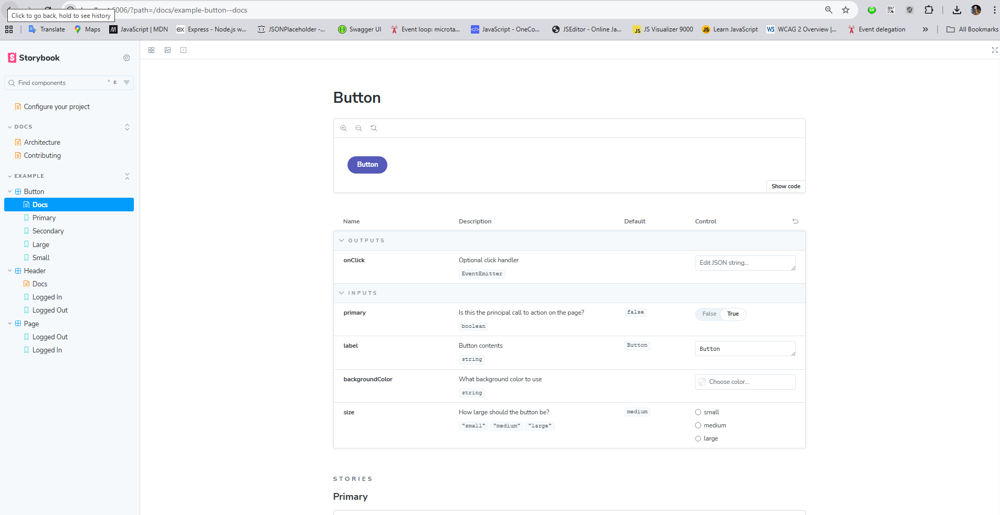
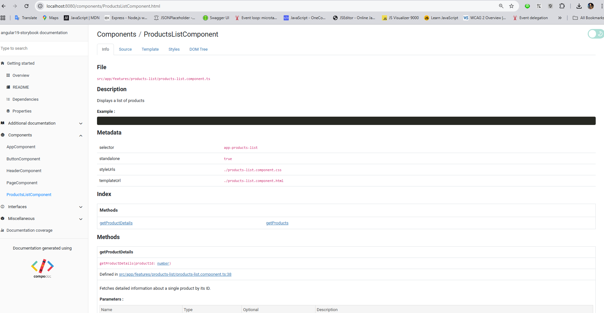

# Angular 19 + Storybook 9.1 + Compodoc Setup Guide

This guide walks you through initializing a new Angular 19 project with Storybook 9.1 and Compodoc.

---

## 1️⃣ Create a new Angular 19 project

```bash
npm install -g @angular/cli
ng new angular19-storybook
# Choose routing: yes/no
# Choose stylesheet format: SCSS recommended
cd angular19-storybook
```

---

## 2️⃣ Install Storybook 9.1

```bash
npx storybook@9.1 init
```

- Detects Angular automatically and configures Storybook.
- Check `/.storybook` folder (`main.ts`, `preview.ts`, etc.).

**Optional**: Install `react-markdown` to render `.md` inside MDX:

```bash
npm install react-markdown
```

---

## 3️⃣ Install Compodoc

```bash
npm install -D @compodoc/compodoc
```

- Generates Angular documentation.

---

## 4️⃣ Add scripts to `package.json`

```json
"scripts": {
  "start": "ng serve",
  "build": "ng build",
  "storybook": "ng run angular19-storybook:storybook",
  "build-storybook": "ng run angular19-storybook:build-storybook",
  "compodoc": "npx compodoc -p tsconfig.app.json --serve",
  "compodoc:build": "npx compodoc -p tsconfig.app.json"
}
```

- `npm run storybook` → Start Storybook at `http://localhost:6006`
- `npm run build-storybook` → Build static Storybook
- `npm run compodoc` → Generate and serve Angular docs `http://localhost:8080`

---

## 5️⃣ Create a sample Angular component

```bash
ng generate component components/button
```

---

## 6️⃣ Add Storybook stories (TS)

`src/stories/button.stories.ts`:

```ts
import { Meta, StoryObj } from "@storybook/angular";
import { ButtonComponent } from "../app/components/button/button.component";

const meta: Meta<ButtonComponent> = {
  title: "Components/Button",
  component: ButtonComponent,
};
export default meta;

type Story = StoryObj<ButtonComponent>;

export const Primary: Story = {
  args: {
    label: "Click Me",
  },
};
```

---

## 7️⃣ Add MDX documentation with raw `.md` files

`src/stories/button.mdx`:

```mdx
import { Meta } from "@storybook/addon-docs";
import ReactMarkdown from "react-markdown";
import buttonMd from "../docs/button.md?raw";

<Meta title="Docs/Button" />

# Button Documentation

<ReactMarkdown>{buttonMd}</ReactMarkdown>
```

---

## 8️⃣ Generate Compodoc docs

```bash
npm run compodoc
```

- Opens `http://localhost:8080`
- HTML docs stored in `documentation/` folder

---

## 9️⃣ Run Storybook

```bash
npm run storybook
```

- Opens Storybook at `http://localhost:6006`
- Add `.stories.ts` or `.mdx` files for components

---

### ✅ Notes

1. **Storybook 9.1 includes essentials by default** — no need to install `@storybook/addon-essentials`.
2. **ReactMarkdown** is needed to render raw Markdown inside MDX files.
3. Compodoc is independent — it documents your Angular project and components.

---

# Integrate Strorybook and Compodoc with Markdown documents

## 📂 Folder Structure

```
project-root/
├── docs/
│   ├── architecture.md
│   ├── contributing.md
│   ├── summary.json
│
├── src/
│   ├── stories/
│   │   ├── Architecture.stories.mdx
│   │   ├── Contributing.stories.mdx
│   │
│   └── app/...
│
├── tsconfig.app.json
├── angular.json

```

Here’s a shared docs structure that works with both Compodoc and Storybook in your Angular 19 project.
## 1️⃣ docs/summary.json

This defines the sidebar menu for Compodoc:

```json
[
  {
    "title": "Architecture Overview",
    "file": "architecture.md"
  },
  {
    "title": "Contributing Guide",
    "file": "contributing.md"
  }
]
```

## 2️⃣ Compodoc Config (MD integration)

Add this script in package.json:

```json
"scripts": {
  "compodoc": "npx compodoc -p tsconfig.app.json --includes docs --serve"
}
```

- --includes docs tells Compodoc to look for extra docs in /docs.

- summary.json defines their order in the sidebar

**Note:** For integrating **Compodoc** with high level **Markdown** add _--includes docs_ to command in package.json.

## 3️⃣ Storybook Config (MDX integration)

3.1 Install Storybook Docs Addon

```bash
npm install @storybook/addon-docs --save-dev
```

3.2 .storybook/main.ts
Add _'options: { transcludeMarkdown: true }'_ to _"@storybook/addon-docs"_ addons.

```ts
import type { StorybookConfig } from "@storybook/angular";

const config: StorybookConfig = {
  stories: ["../src/**/*.mdx", "../src/**/*.stories.@(js|jsx|mjs|ts|tsx)"],
  addons: [
    {
      name: "@storybook/addon-docs",
      options: { transcludeMarkdown: true },
    },
  ],
  framework: {
    name: "@storybook/angular",
    options: {},
  },
  core: {
    builder: {
      name: "@storybook/builder-webpack5",
      options: {
        fsCache: true,
        lazyCompilation: true,
      },
    },
  },
};
export default config;
```

## 4️⃣ Storybook MDX Pages

src/stories/Architecture.mdx

```html
import { Meta } from "@storybook/addon-docs/blocks"; import architectureMd from "../../docs/architecture.md?raw"; import ReactMarkdown from 'react-markdown';

<meta title="Docs/Architecture" />

<ReactMarkdown>{architectureMd}</ReactMarkdown>
```

src/stories/Contributing.mdx

```html
import { Meta } from "@storybook/addon-docs/blocks"; import contributingMd from "../../docs/contributing.md?raw"; import ReactMarkdown from 'react-markdown';

<meta title="Docs/Contributing" />

<ReactMarkdown>{contributingMd}</ReactMarkdown>
```

?raw works with Vite and Webpack to import the raw markdown as a string.
You should use ReactMarkdown to load markdown content.

## 5️⃣ Usage 

Run Storybook

```bash
npm run storybook
```

→ See your /docs content inside the "Documentation" section in Storybook.

Run Compodoc

```bash
npm run compodoc
```

→ See the same /docs content inside Compodoc’s sidebar.

## Screenshots
- Storybook



- Compodoc



## ✅ Advantages of integration Storybook + Compodoc + Markdown

- Single source of truth (/docs)

- Same content in both Storybook & Compodoc

- No copy-pasting

- Easy to maintain

---
